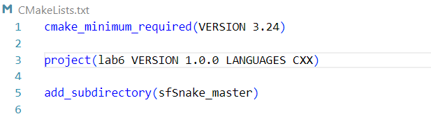
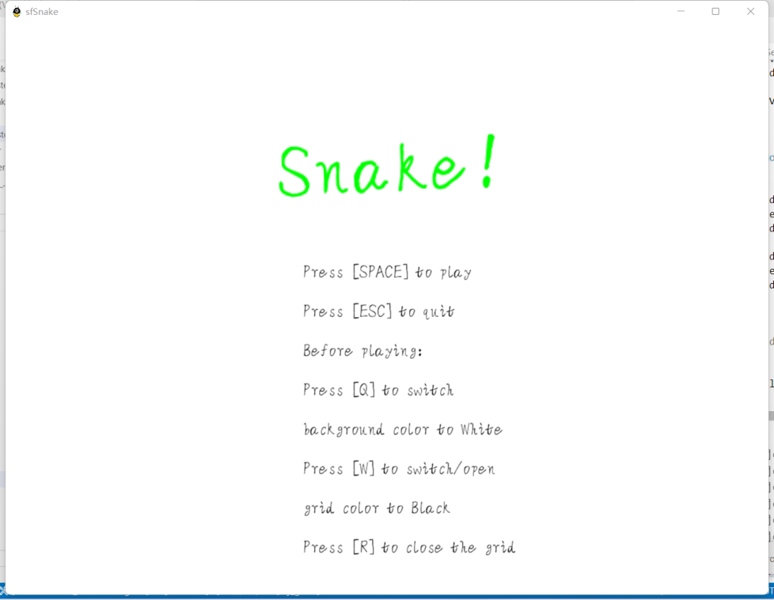

大作业说明

一．编译环境

1. 配置sfml库，sfml 2.5.1
2. gcc 13.0.1 x86_64-w64-mingw32
3. c++ 20
4. 本机为 win11环境， 使用IDE vscode（Visual Studio Code） 对代码进行编译。

二．具体编译步骤

1. 打开vscode，在sfSnake_master文件夹外写一个CMakeLists.txt如下

2. 将sfSnake_master文件夹里的Fonts,Music,pic文件夹复制到build/sfSnake_master文件夹里
3. 点击vscode界面下方build按钮，再点击运行按钮游戏即可出现。

三．游戏说明

1.贪吃蛇的控制方法：

（1）在要求以外，增加了利用 W S A D 四个方向键来控制贪吃蛇的移动，符合笔记本玩家的要求。

（2）可以长按鼠标右键或者左键来操纵蛇的运动，也可以单击改变蛇的运动方向。

（3）为了避免非失误操作造成的自杀行为，游戏设定了贪吃蛇只能接受以运动方向为轴，左右各90度的转向，若鼠标或键盘给的指令在这180度范围之外，则贪吃蛇不会做出回应。具体见Snake.cpp第49行至第70行。

2. 整体界面的修改

（1）改变原字体，让界面看起来更清新一些

（2）在菜单修改界面，按下q键改变背景颜色，按下w键改变网格线颜色，按下r键关闭网格线。且有实时的反馈，让玩家知道进入游戏后会是什么情况。

（3）gameover界面新增按下r返回主菜单功能，方便再次选择背景和网格线颜色。同时修改gameover的黑色界面，使得游戏整体风格一致。

（4）稍微放大了一下原来的窗口，使得游戏更加清楚。

3.蛇的外观

 （1）蛇的头部用sprite用图形绘制，其余部分使用黄色的圆叠加黑色的矩形块绘制，同时蛇身会跟随运动方向作出旋转，使得动作看上去比较流畅顺滑。

4.杂项

（1）修复了损坏的pickup音效，改成了sfml库支持的wav格式文件，使得贪吃蛇吃水果时音效正常。

（2）通过随机生成水果的代码修复了水果总是生成在同一行的问题，同时按照要求按比例生成各类水果，效果各不相同 。

（3）游戏性能方面还算过关，大概需要蛇占满半个屏幕才会导致程序进入无法响应的状态。

（4）修改了程序图标，使程序图标变成可爱的蛇头，而不是默认二进制文件的图标。